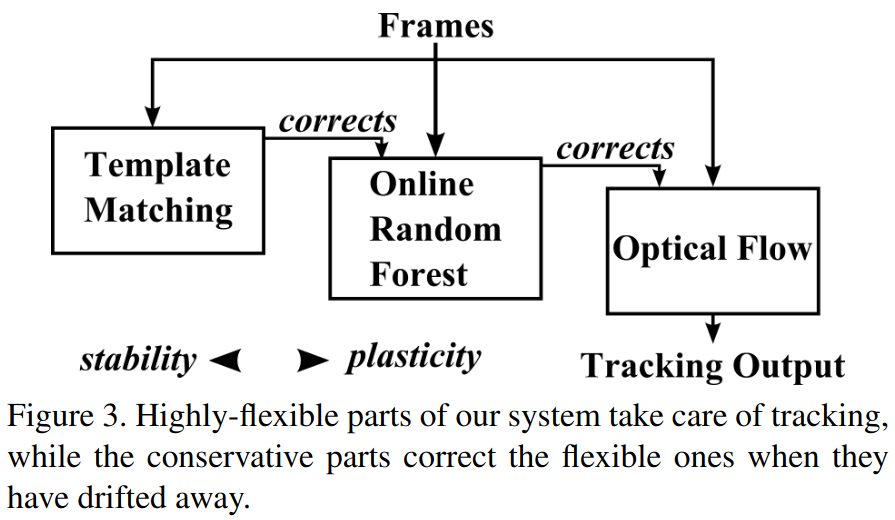

# PROST: Parallel Robust Online Simple Tracking algorithm in Python

This repository provides a Python implementation of the PROST algorithm proposed in ["PROST: Parallel robust online simple tracking"](https://doi.org/10.1109/CVPR.2010.5540145).

The algorithm is implemented with OpenCV and NumPy.

## PROST Components

The PROST algorithm has 3 components that work in a cascade manner.

